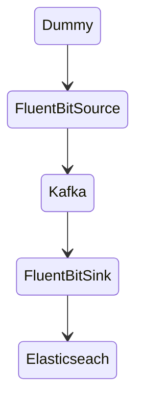

# Fluent Bit - Kafka / Elasticseach

This is a sample setup for ingesting data from kafka into elasticsearch with fluentbit.
Filesystem buffering is enabled for both fluentbit instances. 

## Pipeline



**FluentBit Source: (see [fluent-bit.conf](etc/source/fluent-bit.conf))**
- Dummy Input -> generates random audit events
- Lua Filter [audit_dummy.lua](etc/source/audit_dummy.lua) -> modifies the kafka messages before sending
- Kafka Output -> publishes the events in Kafka

**FluentBit Sink: (see [fluent-bit.conf](etc/sink/fluent-bit.conf))**
- Kafka Input -> consumes audit events from a kafka topic
- Lua Filter [kafka.lua](etc/sink/kafka.lua) -> modifies the event before ingestion into elsaticsearch
- Kafka Output -> publishes the events in elasticsearch


## Getting started

To start the whole infrastructure just run:

```bash
docker compose up
```

Then the following services are available:

- http://localhost:8081 -> kafka ui
- http://localhost:9200 -> elasticsearch
- http://localhost:5601 -> kibana
- http://localhost:2020 -> fluentbit (source)
- http://localhost:2021 -> fluentbit (source)


