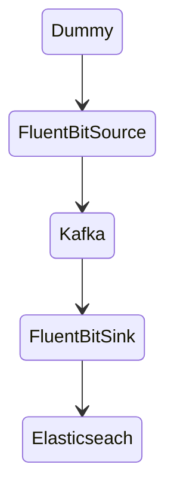

# Fluent Bit Kafka / Elasticseach

This is a sample setup for ingesting data from Kafka into Elasticsearch with Fluent Bit.

The 

## Pipeline

*FluentBit Source: (see [fluent-bit.conf](etc/source/fluent-bit.conf))*
- Dummy Input -> generates random audit events
- Lua Filter [audit_dummy.lua](etc/source/audit_dummy.lua) -> modfies the kafka messages before sending
- Kafka Output -> publishes the events in Kafka

*FluentBit Sink: (see [fluent-bit.conf](etc/sink/fluent-bit.conf))*
- Kafka Input -> consumes audit events from a kafka topic
- Lua Filter [kafka.lua](etc/sink/kafka.lua) -> modfies the event before ingestion into elsaticsearch
- Kafka Output -> publishes the events in elasticsearch

## gtest
